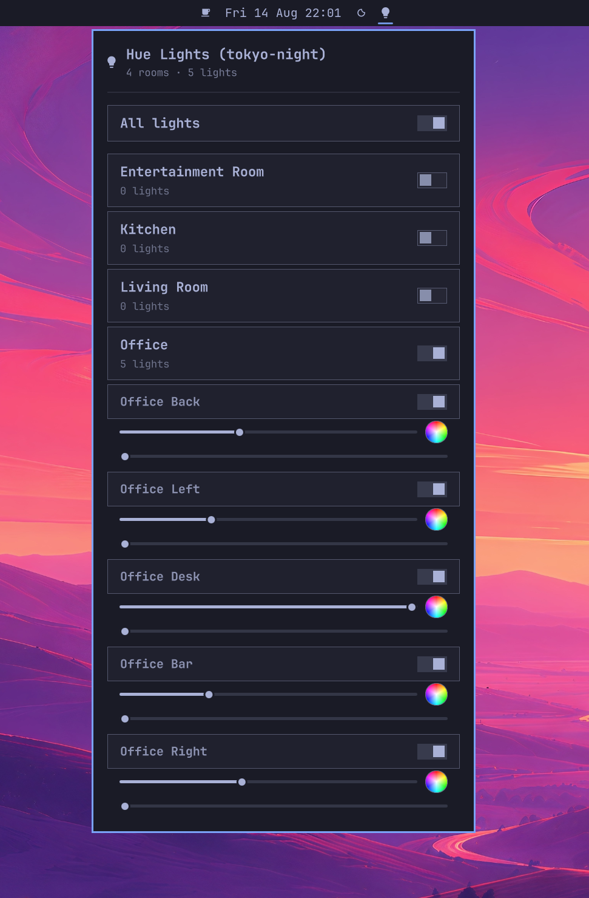

# philips.hue

Omarchy / Quickshell bar widget for controlling Philips Hue lights over the bridge's local HTTP API (v1).

<p align="center">
  
</p>

## Features

- Bar icon (lightbulb) that opens a control panel
- Toggle all rooms, individual rooms, or single lights
- Per-light brightness slider
- Per-light color temperature slider (warm ⇄ cool white)
- Per-light color wheel picker (hue + saturation)
- Reads credentials from `~/.local/state/omarchy/settings/hue.json`
- Retries / re-fetches state automatically after every change

## Requirements

- Arch Linux + Omarchy (Quickshell-based shell)
- `curl`, `python3` (for the pairing script), `omarchy-shell`

## Install

```sh
git clone https://github.com/<your-user>/philips-hue ~/.config/omarchy/plugins/philips.hue
omarchy plugin enable philips.hue
omarchy restart shell
```

## Pairing with the bridge

On first run the panel shows "Not paired". Pair it with:

```sh
~/.config/omarchy/plugins/philips.hue/pair.sh
```

Press the link button on the Hue bridge when prompted. The script discovers the
bridge, requests a username, and writes `~/.local/state/omarchy/settings/hue.json`.
You can also pass an IP directly: `pair.sh 192.168.1.14`.

## Syncing lights with the omarchy theme

A theme-set hook (`45-hue.sh`, vendored in `theme-sync/`) recolors every
room/zone to the active theme's `accent` whenever you run `omarchy theme set`.
The bar widget picks the change up within its 15 s poll.

### Install

The repo ships everything needed under `theme-sync/`:

```sh
~/.config/omarchy/plugins/philips.hue/theme-sync/install.sh
```

This copies `45-hue.sh` to `~/.config/omarchy/hooks/theme-set.d/` (make it
executable) and writes a default `hue-theme.json` to
`~/.config/omarchy/settings/` if you don't have one yet. No shell restart is
needed — the hook is picked up on the next `omarchy theme set`.

To install manually instead:

```sh
mkdir -p ~/.config/omarchy/hooks/theme-set.d ~/.config/omarchy/settings
cp theme-sync/45-hue.sh ~/.config/omarchy/hooks/theme-set.d/45-hue.sh
chmod +x ~/.config/omarchy/hooks/theme-set.d/45-hue.sh
cp -n theme-sync/hue-theme.json ~/.config/omarchy/settings/hue-theme.json
```

Behavior is configured in `~/.config/omarchy/settings/hue-theme.json`:

```json
{
  "enabled": true,
  "transition": 20,
  "groups": ["all"],
  "bri": null,
  "turnOn": false,
  "themes": {}
}
```

- `transition` — fade length in tenths of a second (20 = 2 s)
- `groups` — `["all"]`, or a subset of room/zone names to sync
- `bri` — optional forced brightness (1–254); leave `null` to keep each light's current brightness
- `turnOn` — `true` to turn lights on when syncing; `false` leaves on/off state untouched
- `themes` — per-theme hex overrides, e.g. `{ "spacehaven": "#0c8184" }`; themes without an override use their own `accent`

Test the hook without changing your theme:

```sh
bash ~/.config/omarchy/hooks/theme-set.d/45-hue.sh <theme-slug>
```

## Notes

- Speaks to the bridge over plain HTTP on your LAN with the v1 API
  (`/api/<username>/lights`, `/groups`, etc.) — no cloud, no SDK.
- Credentials are stored per-user in `~/.local/state/omarchy/settings/hue.json`;
  keep that file out of version control.
