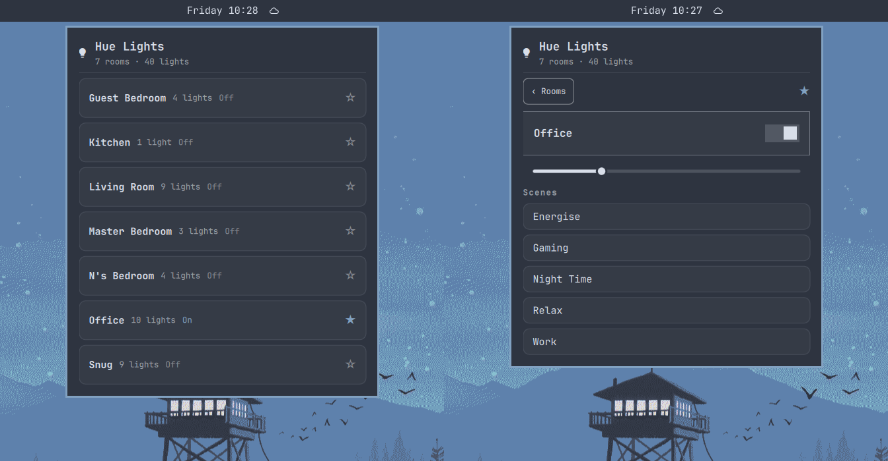

# hue-room-remote

Omarchy / Quickshell bar widget for controlling Philips Hue lights by room,
over the bridge's local HTTP API (v1).

<p align="center">
  
</p>

## Features

- Bar icon (lightbulb) that opens a control panel
- **Room List** — shows every room with lights, each with an icon derived
  from its Hue-assigned room type (bedroom, office, kitchen, etc., falling
  back to a bulb icon where there's no good match) and a switch for on/off.
  Star a room to favorite it; if a favorite is set, the panel opens
  straight to that room instead of the list.
- **Room View** — tap a room to open it: toggle the whole room on/off
  (re-applying whatever scene was last used, rather than switching all
  lights "on" — this is remembered across restarts, not just for the
  current session), and tap a saved scene to apply it instantly.
- **Reorder and hide rooms** — tap the ⚙ in the header to reveal up/down
  arrows (for both the Room List and each room's scene list) and an eye
  icon to hide a room from the list entirely. Hidden rooms reappear
  (dimmed) while the ⚙ is active, so there's always a way to unhide one.
- Brightness changes apply to the whole room, not individual lights.
- Reads credentials from `~/.local/state/omarchy/settings/hue.json`
- Retries / re-fetches state automatically after every change

## Requirements

- Arch Linux + Omarchy (Quickshell-based shell)
- `curl`, `python3` (for the pairing script), `omarchy-shell`

## Install

```sh
omarchy plugin add https://github.com/lunardi0x01/hue-room-remote.git --enable
```

## Pairing with the bridge

On first run the bar shows a lightbulb icon. Click it to open the panel, then
click **Pair with bridge**. This opens a terminal — press the link button on
your Hue bridge when prompted. The script discovers the bridge, requests a
username, and writes `~/.local/state/omarchy/settings/hue.json`. The panel
picks up the new credentials automatically within seconds.

You can also pair manually:

```sh
~/.config/omarchy/plugins/lunardi0x01.hue-room-remote/pair.sh
```

Pass an IP directly to skip auto-discovery: `pair.sh 192.168.1.14`.

## Remove

```sh
~/.config/omarchy/plugins/lunardi0x01.hue-room-remote/cleanup.sh
omarchy plugin remove lunardi0x01.hue-room-remote
```

The cleanup script removes your bridge credentials from
`~/.local/state/omarchy/settings/hue.json`. Run it before removing the
plugin so no auth token is left behind.

## Notes

- Speaks to the bridge over **HTTPS** on your LAN with the v1 API
  (`/api/<username>/lights`, `/groups`, etc.) — no cloud, no SDK.
- TLS is verified with the bundled `hue_bridge_cacert.pem`, the official
  Philips Hue root CA from Signify. During pairing, the bridge's unique ID
  is read from `/api/config` and saved as `bridgeId` in `hue.json`; requests
  are then addressed to that ID so the bridge certificate's hostname is
  matched, while the connection itself goes straight to the bridge's IP.
- Automatic discovery uses Philips' hosted lookup once; pass an IP directly
  to `pair.sh` to skip it.
- If `bridgeId` is missing (e.g. from an older config), the panel warns
  "TLS verification disabled" — re-run `pair.sh` to restore full
  certificate verification.
- Uses the classic v1 local API, which every current bridge still serves —
  including the 2025 Bridge Pro (HTTPS-only, `apiversion` 1.73.x). New Hue
  features ship exclusively in the v2 API and Signify has said v1 will be
  removed long-term, but no end-of-life date has been announced.
- Credentials are stored per-user in `~/.local/state/omarchy/settings/hue.json`;
  keep that file out of version control.

## Credit

This started as a fork of [sethchev/omarchy-philips-hue](https://github.com/sethchev/omarchy-philips-hue),
which laid down the original bridge-pairing and TLS groundwork. It's since
been rewritten with claude code — new room-based UI, bug fixes, an added
test suite — and renamed to reflect that. Both projects are MIT licensed;
see [LICENSE](LICENSE).
